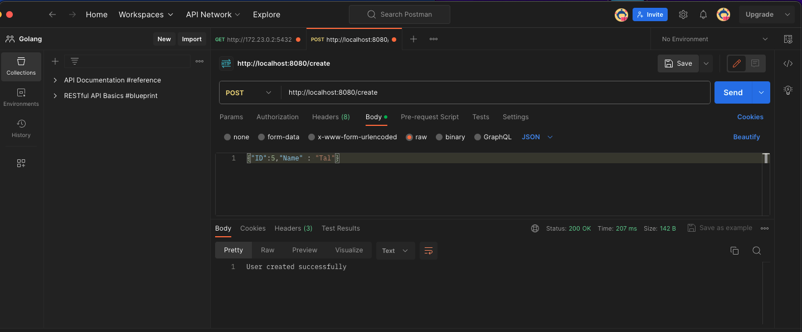
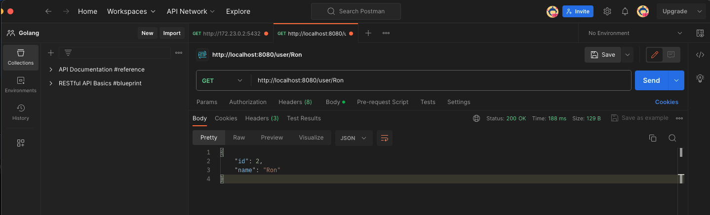
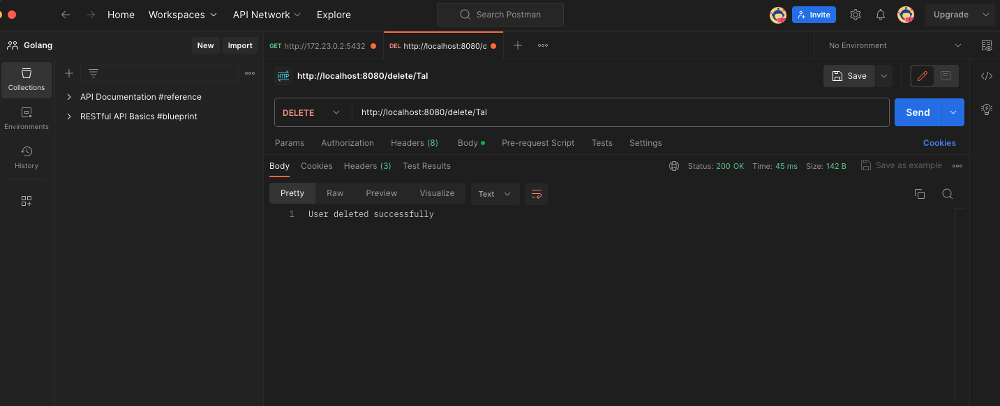

# Golang-PostgreSQL-Dokcer--Project
Building a basic backend service in Golang that interacts with a PostgreSQL database.

## Installation Steps:

1. Download Docker.
2. Create a folder and clone the GitHub repository into it.
3. Open the terminal in the created folder.
4. Install dependencies using the command: go mod tidy.
5. Install the PostgreSQL driver: go get github.com/lib/pq.
6. Install the Gorilla Mux router: go get github.com/gorilla/mux.
7. Run the following command in the terminal to build and start the application: docker-compose up --build.

## Images
<kbd>
  
  
  
  
</kbd>

